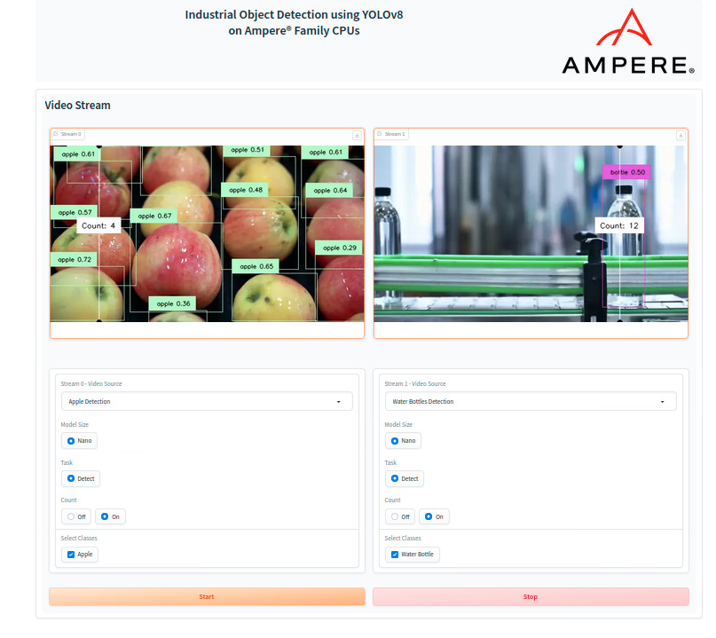

# View-Ampere-AI-Demo
## Manage and Deploy Industrial YOLOv8 Demo

* Enable firewall for public access
    + Install firewall application:
      
       ```$ sudo apt update```
      
       ```$ sudo apt install firewalld```


    + Open ports:

      ```$ sudo firewall-cmd --zone public --permanent --add-port 5000-5010/tcp```
      
      ```$ sudo firewall-cmd --reload```

* Install docker application
  
  ```$ sudo apt-get update```
  
  ```$ sudo apt-get install ca-certificates curl gnupg```

  ```$ sudo install -m 0755 -d /etc/apt/keyrings```

  ```$ curl -fsSL https://download.docker.com/linux/ubuntu/gpg | sudo gpg --dearmor -o /etc/apt/keyrings/docker.gpg```

  ```$ sudo chmod a+r /etc/apt/keyrings/docker.gpg```

  ```$ echo "deb [arch="$(dpkg --print-architecture)" signed-by=/etc/apt/keyrings/docker.gpg] https://download.docker.com/linux/ubuntu "$(. /etc/os-release && echo "$VERSION_CODENAME")" stable" | sudo tee /etc/apt/sources.list.d/docker.list > /dev/null```
         
  ```$ sudo apt-get update```

  ```$ sudo apt-get install docker-ce docker-ce-cli containerd.io docker-buildx-plugin docker-compose-plugin```

+ Make sure docker is installed properly:
     ```$ sudo docker run hello-world```

+ Add user to the docker group:
  ```$ sudo usermod -aG docker $USER```

 + Logout and login back to the machine
 + Check docker is added to your groups:
   ```$ groups```
  
### Launching the demo web application service
* Clone demo repo:
  ```$ git clone https://github.com/ampere-solution/View-Ampere-AI-Demo.git```

* Start the demo:
  ```./start-yolo-cpu.sh```

* Open the browser and go to the http://<ip-address>:5002
* Demo UI
  

## Manage and Deploy View AI Demo
### Create VM 
* Install QEMU,KVM and required tools
  ```$ sudo apt update```

  ```$ sudo apt install qemu-kvm libvirt-daemon-system libvirt-clients bridge-utils virt-manager -y```

* Start and enable libvirt Service:
  ```$ sudo systemctl enable --now libvirtd```

* Verify that the service is running:
  ```$ sudo systemctl status libvirtd```

* Add to the libvirt group:
  
  ```$ sudo usermod -aG libvirt $(whoami)```

  ```$ newgrp libvirt```

* Download an ARM64 Ubuntu 24.04 ISO Image
* Check to see if default network is running:
  ```
  $ virsh net-list --all
* Create ARM-based VM:

  ```
  virt-install --name view-demo \
    --ram 65536 \
    --vcpus 48 \
    --disk path=/var/lib/libvirt/images/view-demo.qcow2,size=100 \
    --os-variant ubuntu24.04 \
    --cdrom /var/lib/libvirt/images/ubuntu-24.04.2-live-server-arm64.iso \
    --arch aarch64 \
    --machine virt \
    --network network=default \
    --graphics vnc

* Check to see if VM is running: ```virsh list --all```
* Access to VM: ```virsh console view-demo```

### Deploy View AI Demo in VM
* Open the terminal and run the curl command at command prompt:  ```curl -s https://get.view.io | bash -s YOUR_GUID```
